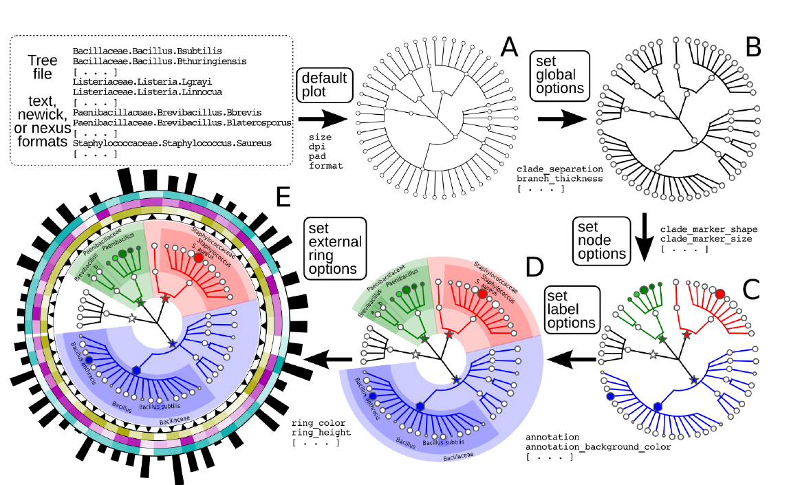

# 宏基因组可视化平台文献调研报告

## EzTaxon(2007)
 这就是一个简单的小平台,用户通过网页,将数据上传到网站,服务器接收数据后,处理数据(所有的计算都在服务器),并返回结果.  
 在该服务器上有用于taxonomy的数据库,然后通过多序列比对,再可以通过使用 neighbor-joining,maximum-parsimony,maximum-likelihood方法调用PHYLIP包生成来生成系统发生树.  
 **在可视化方面并没有什么可圈可点之处.**

## ETE3(EMBL)
这是EMBL开发的一个python程序包,可以用来生成各种树,不过都是静态的不具有交互功能的.其中和我们相关的就是它有一个api(ncbiquery)可以查询到给定物种的lineage(界门纲目科属种等)参考数据库是NCBI taxonomy.
## iTOL(EMBL)
这是一个基于web的,只要输入一棵树(Newick,Nexus,PhyloXML)它就可以实现手动折叠部分树枝,或者自动隐藏部分树枝,而且支持各种格式的可视化结果下载.
## W-IQ-TREE(2016)
这也是一个基于web的软件,用户上传软件,然后在服务器上计算等数据处理,最后返回结果.与EzTaxon不同的是它建立系统发生树的时候速度更快,还有进行bootstrapping验证等步骤  
**可视方面也只是调用了一下ETE-view**

## GraPhlAn(2015)
这是一个python程序包,可以用来画环形的系统发生树,可以通过不同的选项,可以画出不同复杂程度的树.不具有交互功能

## MicrobiomeAnalyst(2017)
这是一个基于web的工具,它包括了四个模块,其中只有一个模块(Marker Data Profiling)和我们的相关度较大.  
它对于矩阵类型的数据的处理的可视化以及一些统计分析都做得很全面,可视化也是可以交互的,同时还可以生成高质量的可下载的图片,具体可以参考这个slides [Marker Data Profileing](MDP.pdf).  
它对于annotation部分它画的是一个饼图,不过饼图是可以一层一层的点开的.

## 总结
 前面所提到的论文中,所有基于web的且可视化做的好的就是iTOL和 MicrobiomeAnalyst.其他不是基于web的工具,可视化方面不具有交互功能.我们要做的**annotation结果染色**,和**数据矩阵**部分,基本已经被MicrobiomeAnalyst都能够很好的实现了.iTOL对于树的处理已经可以算是很灵活的了这是我们可以学习的方向,但是它处理的是已经生成的树(newick,Nexus等格式),我们还能改进的就是利用不同方式生成的OTU(固定阈值划分,VI-cut)等方法那么生成的树就不太一样.  
 最后,就是各个工具擅长的点不一样,有的可能侧重于形成系统发生树,而可视化部分就一笔代过,有的工具就仅仅是可视化效果好,缺少一个统一的平台在这两方面都有优秀表现.